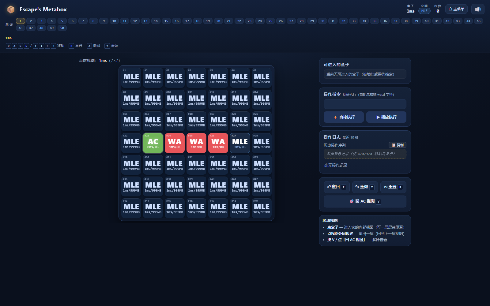

# Escape's Metabox

> 一款关于「盒子」的方格解谜游戏。
> **规则不写在这里 —— 它们就是你在游玩过程中要自己发现的东西。**



---

## 这是什么

你在一片方格上控制一个小小的身影，一格一格地走。
屏幕上会出现「盒子」「空间」「标号」这样的词 ——
**它们之间到底怎么互相影响，正是这款游戏真正的谜面**。

所以这份说明只讲**怎么操作**和**怎么用编辑器**，绝不讲规则 ✓
内置冒险有一条完整的主线：从 **1ms** 出发，一路走到 **50ms** 的出口，路上还藏着几个彩蛋。
迷路很正常 —— 每一关都允许你反复试探，走错了随时退回来就行。

## 怎么玩

| 操作 | 效果 |
|---|---|
| `W` `A` `S` `D` / 方向键 | 移动 |
| `R` | 重置本关（回到起点） |
| `Z` / `Y` | 撤回 / 重做一步 |
| `V` 或右栏「回 AC 视图」 | 把视图拉回主角所在的地方 |
| 右栏「操作指令」+ 直接执行 / 播放执行 | 想连着走一串（例如 `wdwd`）时用它，可以整段执行或按速度播放 |

界面本身会一路给你提示：顶栏告诉你**现在在哪**、以及已经到过哪些地方（到过的可以直接跳回去）；
右栏会实时列出**当前可用的操作**与操作记录。**拿不准就乱点乱走** —— 这里没有会导致死局的惩罚 ✓

## 创造模式：自己做关卡

点开始界面的「创造模式」，进入**关卡管理器**：

- 一个关卡 = 一个名字 + 一个**盒子边长**（不小于 5 的奇数，默认 7×7）+ 若干「盒子」
- 每关一排选项：**重命名 / 编辑 / 导出 / 删除**；点关卡卡片就是**游玩本关**
- 支持**批量**：勾选多个 ⇒ 一起导出（每关一个 `.json`，方便发给别人）或一起删除
- 「编辑关卡」里新建/编辑每个盒子（刷墙、开空地、放盒子、标起点与终点），改完可以**就地试玩**
- 撤回/重做分两档：编辑某个盒子时那一组只管这个盒子；编辑关卡时那一组管一整个盒子的改动

关卡的存放方式（重要）：

| 类别 | 存在哪 | 别人能看到吗 |
|---|---|---|
| 内置冒险 | 随代码一起发布 | 所有人一样 |
| **你自己的本地关卡** | 你自己浏览器的 localStorage | **只有你自己**（换浏览器、清站点数据会没，重要关卡记得先「导出」备份） |
| 共享关卡 | 仓库里的 `levels/index.json` | 所有人一样，可一键「复制到本地」再改成自己的 |

## 跑起来

```bash
# 最简单：直接双击 index.html（file:// 就能玩）
# 或者起一个本地静态服务器（更接近线上环境）
npx serve .
```

**发布到 GitHub Pages**：把仓库 Settings → Pages 设为 `main` / 根目录即可 ——
页面全部使用相对路径，不需要任何构建步骤 ✓

## 项目结构

```
index.html             整个页面（界面 + 编辑器 + 引擎接线）
src/engine.js          游戏引擎（UMD 单文件，无依赖）
src/levels.data.js     内置冒险的关卡数据
data/box-*.json        同一批关卡的分文件版本（可选）
levels/index.json      共享关卡清单（想让所有人玩到你的关卡就往这里加，见下）
screenshot.png         封面截图
发布指南.md            上线到 GitHub Pages 的文件清单与步骤
spec/ · dev/           ⚠️ 规范与开发验收材料：**含移动规则的完整推导（剧透）**，想保持新鲜感就别翻
```

**把自己的关卡发布给所有人**：在「关卡管理器」里勾选关卡 ⇒「导出所选」⇒
把导出的 JSON 贴进 `levels/index.json` 的 `levels` 数组 ⇒ 提交推送 ✓
（清单格式与上线步骤见 `发布指南.md`）

## 技术

纯前端、零构建、零依赖：一个 `index.html` + 一个 UMD 引擎 + 一份关卡数据，
clone 下来双击就能玩；引擎与界面都不依赖任何框架或第三方库。

仓库里的 `dev/` 是一整套 Node 回归脚本（引擎自测、金标轨迹逐字比对、UI 契约与端到端、无头浏览器几何量测）：

```bash
node dev/regress-all.js        # 全量回归总闸（改完引擎跑这个）
node src/replay.js --selftest  # 引擎自测
```

改完引擎跑一遍总闸，就知道有没有把别的地方弄坏 ✓
